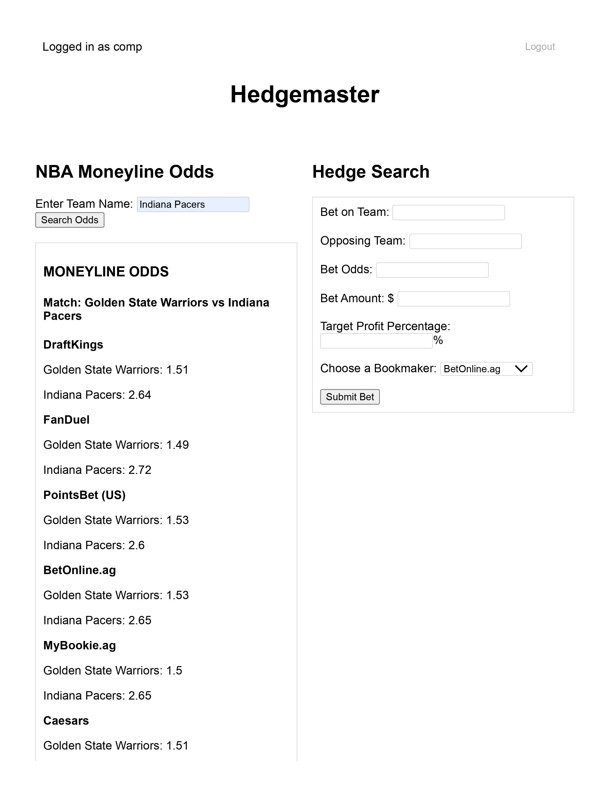

# Hedgemaster

This repository contains the code required to run Hedgemaster, a web application that automatically stores bets and finds hedging opportunities. The current production version of this application can be found [here](https://hedge.chompe.rs/).

## Requirements

In order to run this application locally you will need:
* Python 3.x
* Poetry
* SQLite (if you would like to access the database locally)
* the-odds-api key (for local use only)

## Local Usage

First, if you would like to run the app locally you will need an API key from the-odds-api. To receive one go [here](https://the-odds-api.com/) and select a free or paid plan. Once you have your key you will need to make a file called `config.py` inside of the `src` folder. In this file you should create a variable named `API_KEY` and assign it as your key in string format.

In order to use this application locally you will need to navigate to the root of the directory and enter the following in the command line:

```console
poetry install
```

This will install all of the necessary dependencies for the project. Next you need to run the application you can do so by entering:

```console
poetry run python src/hedge.py
```

This will run the Python file that contains the Flask application. It should then tell you where the application is running in the console. Simply go to that address and you will be taken to the web app.

## Web Usage

The landing page for the web app is a login page that should look like this:


From click the register button where you can create an account then it should take you back to the login page where you can enter your credentials. Then you will be taken to the main page where you can browse odds, enter your bets, and view your bets which should look like this:



Then if you want to check if you have any hedges there are three ways to do so you can either:

* Check by re-entering your bet in the web interface
* Browse the `hedge` table in the database using SQLite
* Monitor the console output, as it will notify you when a hedge is automatically found

## Feedback

If you have any suggestions or run into any bugs feel free to leave an issue, thanks!